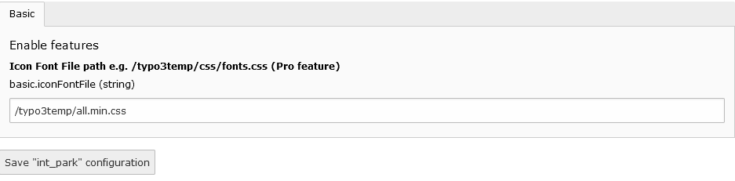

.. include:: ../Includes.txt

.. _configuration:

=============
Configuration
=============

Target group: **Editors**

Most of the configuration options are eiter in TCA or extension configuration.

Icon Font CSS
===============

You have to specify the icon font css path so that icons can be shown in the backend editor. This can be done in extension configurations.

   Extension Configuration

Template override
===============

- You can override template files by overriding the template path in Typoscript.

For example.

.. code-block:: typoscript

   plugin.tx_intpark_map {
      view {
         templateRootPaths {
            0 = {$plugin.tx_intpark_map.view.templateRootPath}
            1 = fileadmin/templates/int_park/Templates/
         }
         partialRootPaths {
            0 = {$plugin.tx_intpark_map.view.partialRootPath}
            1 = fileadmin/templates/int_park/Partials/
         }
         layoutRootPaths {
            0 = {$plugin.tx_intpark_map.view.layoutRootPath}
            1 = fileadmin/templates/int_park/Layouts/
         }
      }
   }

