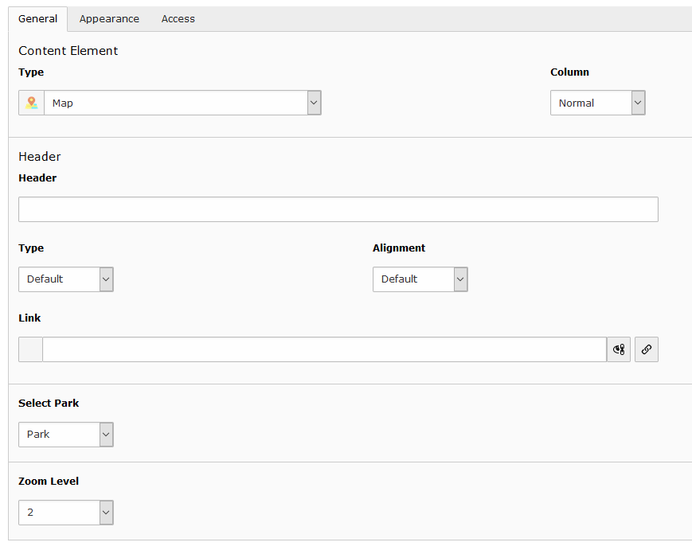
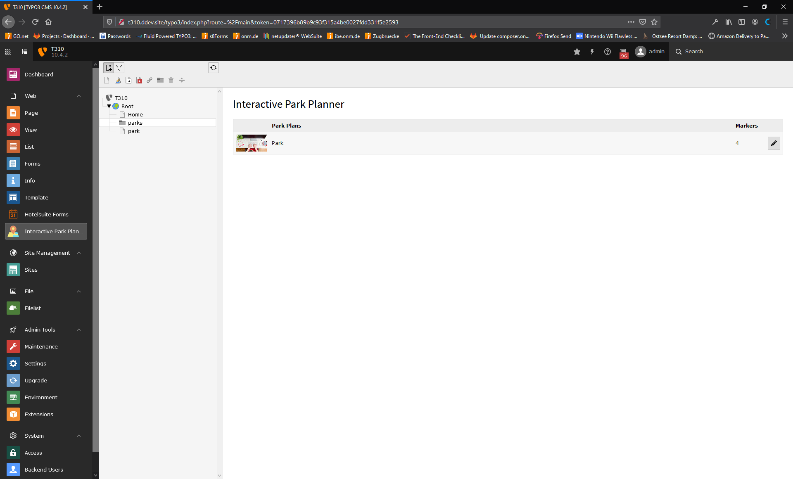
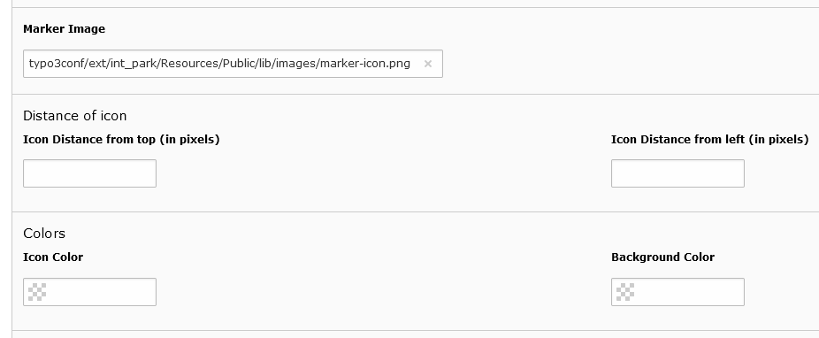
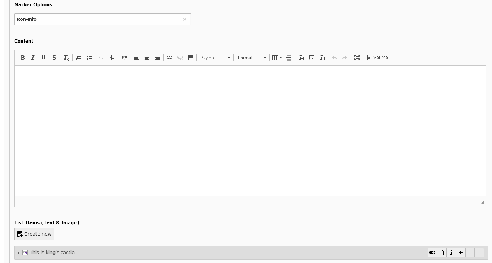

.. include:: ../Includes.txt

.. _for-editors:

===========
For Editors
===========

Target group: **Editors**

Initial Zoom of the image
=========================

You can select initial zoom of the image from the park content element.

   Park and initial zoom can be seelected.

Park Planner Backend Module
===========================

   Backend Module

Backend editor to place markers on image
========================================

By clicking on the title of the map or the image will open a popup with image to place markers and specify icon and title of the marker.
Clicking on image will palce a marker there and will open a popup with an editor. Where you can specify 2 values. First is icon and then after pipe symbol is the title. (Icon can only be specified in pro version)

.. figure:: ../Images/backend_map.png
   :class: with-shadow
   :alt: Backend Editor
   :width: 100%

   Backend Editor

.. tip::

   You have to specify icon font css file in ext configuration to show icon inside marker in backend editor.

Map options
===========

Marker image, icon and background color, and icon's top left values can be set in map options. (These are pro features, so to get pro version please contact: https://www.onm.de/kontakt/ )

   Map options

Marker options
==============

In marker TCA, icon class can be specified, as well as its content. Content can be specified in 2 ways, one way is using RTE and other way is to add default Text & Image element via inline option. So multiple text and image elements can be added.

   Marker options

For any queries please contact
==============================

Open New Media GmbH Agentur für digitale Kommunikation

Simrockstraße 5 56075 Koblenz

Tel.: +49 261 30380-80 Fax: +49 261 30380-88

E-Mail: info@onm.de

Web: https://www.onm.de
