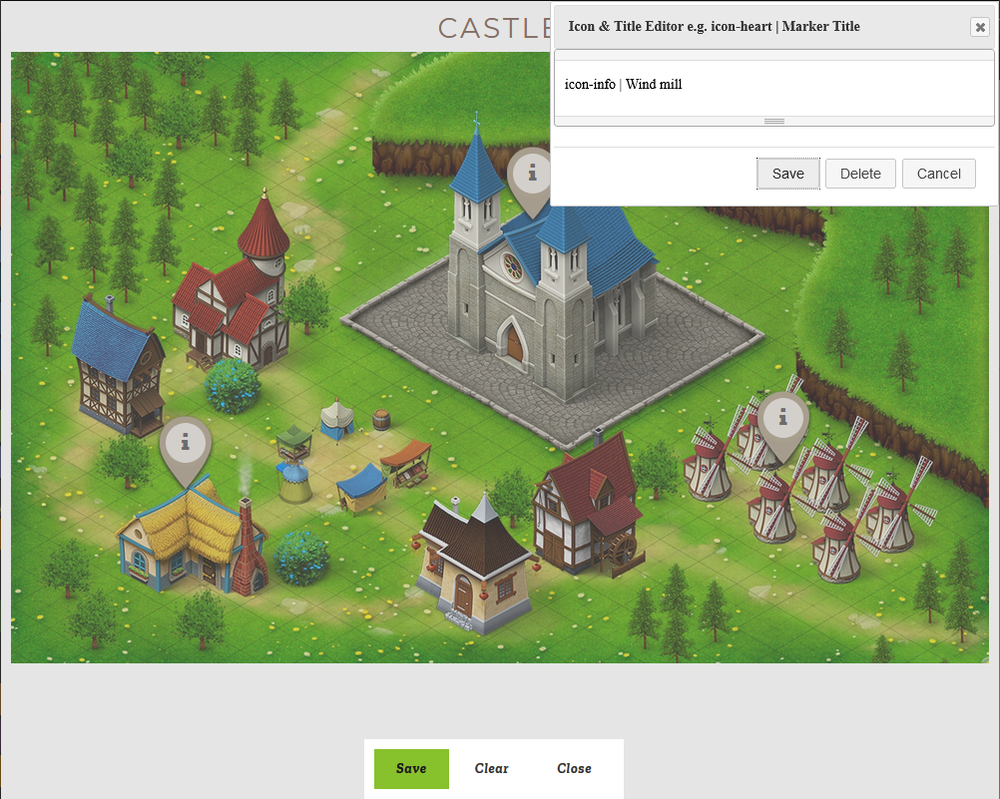

.. include:: ../Includes.txt

.. _introduction:

============
Introduction
============

.. important::

   There is also a pro version of this extension with extra features.

   Get in contant:
   https://www.onm.de/kontakt/

.. _what-it-does:

What does it do?
================

This extension let you make an image as a map and you can place markers on the image and store some content on marker from the Backend module.
Key points of this extension are:

* Backend module to place markers on the image and specify its icon and title
* Write content for each marker in TYPO3 RTE, even can place images.
* On frontend it shows the image as a map using leaflet library and markers on it

.. _screenshots:

Screenshots
===========

How frontend will look like with the image and markers on them.

.. figure:: ../Images/map_rendered.png
   :class: with-shadow
   :alt: Map with markers
   :width: 100%

   Image showing markers and content of the marker inside a tooltip

Backend editor where you can place markers on the image and specify icon and title.

   Placing markers on the image in the backend module